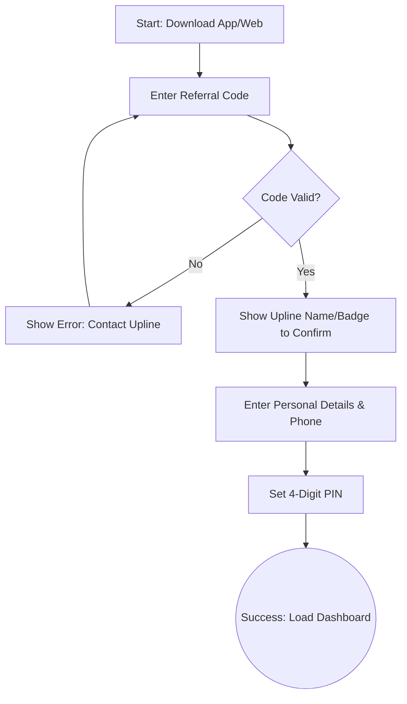
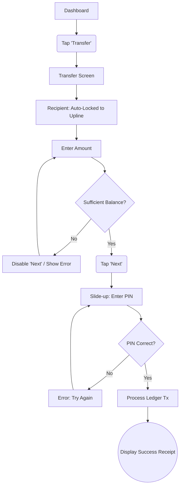
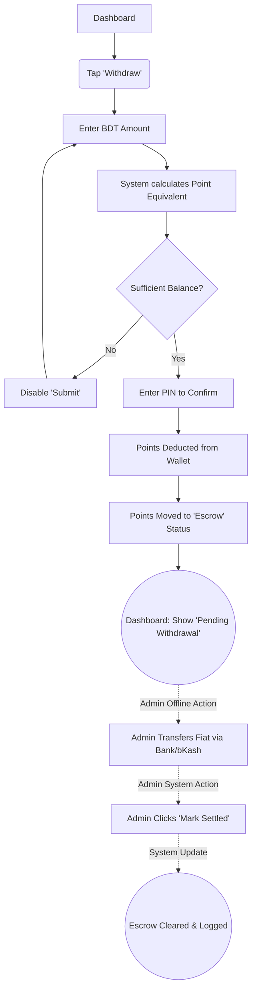

# UX Design Specification srfmart

**Author:** Yamin
**Date:** 2026-05-12

---

<!-- UX design content will be appended sequentially through collaborative workflow steps -->

## Executive Summary

### Project Vision

Srfmart is a secure, referral-based points wallet platform in Bangladesh that acts as a closed-loop economy. It enables community leaders to distribute rewards and allows users to request real-money withdrawals through a managed, highly auditable pipeline while strictly preventing MFS fraud vectors via an upward-only point transfer constraint.

### Target Users

- **Users:** Community participants or students who earn points by completing tasks and seek a frictionless, trustworthy way to convert points into real money (bKash/Nagad/Rocket).
- **Moderators:** Community leaders managing volunteers, requesting payouts, generating invites, and distributing point rewards without manual spreadsheet tracking.
- **Admins:** System administrators overseeing point minting, managing withdrawals, global point distribution, role assignments, and fraud monitoring.

### Key Design Challenges

- Designing an intuitive and extremely fast onboarding flow for users that necessitates a referral code without causing drop-off.
- Making the upward-only transfer constraint clear and comprehensible so users do not get confused when they cannot send points peer-to-peer.
- Managing complex state on the dashboards for Admins and Moderators (such as withdrawal queues and global distributions) without overwhelming the user interface.

### Design Opportunities

- Creating a real-time, highly trustworthy "ledger view" that feels as secure and reliable as a top-tier banking app to establish immediate credibility.
- Building a streamlined, one-click global point distribution UI for Admins that simplifies a complex operation into a satisfying and powerful interaction.
- Employing micro-interactions and clear visual status indicators in the withdrawal process to alleviate user anxiety while waiting for their payouts.

## Core User Experience

### Defining Experience

The core experience of Srfmart revolves around the secure earning and seamless withdrawal of points. For end-users, it is a frictionless journey of tracking balances and converting points to real money (bKash/Nagad/Rocket). For Admins and Moderators, the core experience is about the powerful, effortless distribution of rewards and the absolute control over system integrity.

### Platform Strategy

Srfmart is a mobile-first web application built with Next.js. While the end-user journey is strictly optimized for touch interfaces and small screens, the Admin and Moderator dashboards are responsively designed to support complex data visualization and queue management on desktop environments.

### Effortless Interactions

- **Global Point Distribution:** Admins can distribute points to the entire user base with a single, satisfying action.
- **Team Rewards:** Moderators can pay out their entire volunteer roster instantly, replacing hours of manual spreadsheet work.
- **Real-Time Balances:** Users experience instantaneous balance updates and transparent transaction histories without manual refreshes.

### Critical Success Moments

- **The First Payout:** A user successfully initiates a withdrawal, sees the points enter escrow, and receives clear status updates, building absolute trust in the platform.
- **The Fraud Catch:** An Admin easily identifies a coordinated Sybil attack via the risk dashboard and neutralizes it with one click.
- **The Effortless Friday:** A Moderator distributes weekly points to 20 users in two minutes.

### Experience Principles

- **Trust through Transparency:** Deliver a banking-grade UI with clear, immutable transaction logs.
- **Guided Constraints:** Proactively communicate systemic rules (like upward-only transfers) through intuitive UI design rather than frustrating error messages.
- **Frictionless Administration:** Abstract complex ledger operations into simple, powerful administrative controls.
- **Anxiety-Free States:** Provide immediate, deterministic feedback for every transaction to eliminate user uncertainty and double-submissions.

## Desired Emotional Response

### Primary Emotional Goals

- **Absolute Trust & Confidence:** Users must feel that the platform is entirely secure and that their points (and real money) are safe.
- **Empowerment & Efficiency:** Moderators and Admins should feel highly capable and relieved from the burden of manual tracking.
- **Community Belonging:** Users should feel they are part of an exclusive, trusted network due to the referral-only nature of the platform.

### Emotional Journey Mapping

- **Discovery/Onboarding:** Users start curious but cautious. A professional, banking-grade UI immediately establishes legitimacy and overcomes skepticism.
- **Earning Points:** Users feel motivated and engaged as they see their balance increase in real-time.
- **Withdrawing Points:** A moment of high anxiety is immediately transformed into relief and certainty through clear "Pending" states and instant visual feedback.
- **Administrative Tasks:** Moderators and Admins transition from the stress of manual spreadsheets to the deep satisfaction of one-click bulk distributions.

### Micro-Emotions

- **Trust vs. Skepticism:** Addressed by a polished, professional UI and transparent transaction histories.
- **Confidence vs. Confusion:** Addressed by explicit error messaging and clear explanations of systemic constraints (e.g., the upward-only transfer rule).
- **Relief vs. Anxiety:** Addressed by ensuring point balances are never ambiguous, especially during the withdrawal lifecycle.

### Design Implications

- **For Trust:** Utilize crisp, high-contrast typography, standard financial color paradigms (e.g., green for additions), and immutable, easily scannable transaction logs.
- **For Relief:** Clearly separate "Available Balance" from "Pending/Escrow Balance" so users always know exactly where their points are during a withdrawal.
- **For Confidence:** When enforcing the upward-only transfer rule, use contextual, educational UI copy rather than harsh, generic error messages to guide the user.
- **For Empowerment:** Design administrative actions (like Global Distribution) to feel substantial and satisfying, providing clear confirmation summaries before and after execution.

### Emotional Design Principles

- **Security as a Feature:** Make the security and integrity of the ledger visible to the user.
- **No Ambiguous States:** Every action must result in immediate, deterministic visual feedback.
- **Respect the User's Time:** Administrative interfaces must prioritize density and efficiency over excessive whitespace.

## UX Pattern Analysis & Inspiration

### Inspiring Products Analysis

- **bKash & Nagad:** These dominant local MFS apps set the baseline for user expectations. Their strengths lie in extreme simplicity, large touch targets, and privacy-conscious features (like tap-to-reveal balances).
- **Modern Fintech (e.g., Wise, Revolut):** These platforms excel in data density and ledger clarity, using strict color-coding and highly scannable transaction histories that build trust.

### Transferable UX Patterns

- **Tap-to-Reveal Balance:** Adopted from local MFS apps, providing privacy in public spaces and a familiar, satisfying micro-interaction.
- **Card-Based Action Grids:** Utilizing large, prominent buttons on the home dashboard for primary actions (Withdraw, Transfer) to accommodate mobile touch interfaces.
- **Bottom-Bar Navigation:** Using a native-app style bottom navigation bar on mobile viewports for quick switching between Home, Ledger, and Profile.

### Anti-Patterns to Avoid

- **The "Gotcha" Error State:** Never allow a user to fill out a full transfer form only to fail them on submission. Constraints (like upward-only transfers) must be enforced via UI limitations (e.g., dropdowns instead of text inputs).
- **Vague Processing States:** Avoid simple "Pending" labels on withdrawals without accompanying timestamps or context.
- **Unfilterable Ledgers:** Avoid presenting Admins or Moderators with infinite scrolling lists of transactions without robust date/user filtering tools.

### Design Inspiration Strategy

- **Adopt:** The strict, color-coded transaction ledger pattern from top-tier banking apps to establish absolute trust.
- **Adapt:** Take the familiar "Send Money" flow and adapt it into a highly constrained "Transfer Upward" interface, strictly limiting recipient choices to the user's verified Moderator or Admin.
- **Avoid:** Free-text inputs for critical financial routing to prevent user error and enforce system topology rules.

## Design System Foundation

### 1.1 Design System Choice

**Shadcn UI combined with Tailwind CSS**

### Rationale for Selection

- **Trust-Inspiring Aesthetics:** The default visual language is clean, modern, and highly professional, aligning perfectly with the primary emotional goal of establishing absolute trust and confidence in the platform's financial ledger.
- **Speed meets Flexibility:** As Srfmart requires a lean MVP development cycle, Shadcn UI provides accessible, robust components out-of-the-box while allowing the development team full control over the component code to enforce strict constraints (like disabling specific inputs for upward-only transfers).
- **Next.js Synergy:** It is heavily optimized for the Next.js App Router, ensuring high performance for the mobile-first frontend.

### Implementation Approach

- Initialize a Next.js project with Tailwind CSS.
- Install Shadcn UI and configure the base theme (colors, typography) to match local MFS expectations (e.g., high contrast, specific alert colors for financial states).
- Incrementally add components only as needed (e.g., Data Tables for the Admin ledger, Dialogs for the withdrawal escrow confirmation) to keep the bundle size small.

### Customization Strategy

- **Financial Color Palette:** Customize Tailwind tokens to use strict semantic colors: stark greens for incoming points, clear reds for deductions, and unambiguous neutral tones for pending/escrow states.
- **Component Constriction:** Modify base input components to visually support "locked" or "constrained" states out-of-the-box, ensuring users understand when an action (like a P2P transfer) is not permitted.

### 2.1 Defining Experience

**The "Upward Transfer" (Account Settlement)**
The core interaction of Srfmart is the secure, constrained transfer of points upward through the hierarchy. Unlike traditional digital wallets that allow free-form P2P transfers, Srfmart restricts movement to a user's verified upline (User → Moderator, or Moderator → Admin). Nailing this experience means making this limitation feel like a powerful security feature rather than a frustrating restriction.

### 2.2 User Mental Model

- **Current Metaphor:** Users are accustomed to generic "Send Money" features in apps like bKash, where they must carefully type and verify a recipient's phone number, leading to anxiety about sending funds to the wrong person.
- **Srfmart Metaphor:** The mental model here shifts from "Sending Money" to "Settling an Account" or "Returning Points."
- **Expectation:** Users expect zero friction when identifying the recipient, because the system already knows who their Moderator or Admin is. The anxiety of "wrong number transfers" should be entirely eliminated by the UI.

### 2.3 Success Criteria

- **Zero-Routing Anxiety:** The user should never have to type a phone number to route funds. The recipient is pre-selected and locked.
- **Instant Ledger Clarity:** Upon transfer, the sender's balance must instantly deduct, and the transaction must immediately appear in both users' ledgers.
- **Error Prevention:** The system must actively prevent users from attempting to transfer more than their available balance *before* they hit submit.

### 2.4 Novel UX Patterns

- **Pre-Locked Recipients:** Instead of a contact list or a blank phone number input, the transfer screen features a prominent, uneditable "Recipient Card" displaying the verified name and badge of their specific Moderator/Admin.
- **Directional Visual Cues:** Using UI animations or iconography that implies points are moving "Up" the hierarchy, reinforcing the system's topology.
- **Established Patterns:** We will rely on established patterns for the final execution step: a secure PIN entry bottom-sheet followed by a satisfying, full-screen success receipt.

### 2.5 Experience Mechanics

**The Step-by-Step "Upward Transfer" Flow:**

1. **Initiation:** The user taps the primary "Transfer" action button on their dashboard.
2. **Interaction (The Form):** 
   - A screen opens where the "To:" field is already populated with their Moderator's verified profile card (Locked).
   - The user taps the "Amount" field. A numeric keypad appears.
   - Real-time validation checks the entered amount against the available balance.
3. **Verification:** The user taps "Next" and a secure bottom-sheet slides up requesting their 4-digit PIN.
4. **Feedback & Completion:** 
   - A brief, secure loading state occurs.
   - A distinct "Success" sound and visual animation play.
   - A shareable receipt is displayed, and the updated balance is immediately reflected on the home dashboard.

## Visual Design Foundation

### Color System

To achieve a "banking-grade" aesthetic that builds instant trust, Srfmart will utilize a high-contrast, strictly semantic color palette:

- **Primary Brand (Trust Slate):** A deep, authoritative blue/slate (e.g., Slate-900) for primary actions, headers, and active navigation states. It conveys stability and institutional security.
- **Semantic Financials:**
  - **Inbound/Available (Secure Green):** A distinct, accessible green for incoming transfers, available balances, and success states.
  - **Outbound/Deduction (Alert Red):** A clear red for withdrawals, outward transfers, and error states.
  - **Escrow/Pending (Neutral Amber):** A muted amber or gray for pending withdrawals to ensure users don't mistake them for completed actions.
- **Backgrounds & Surfaces:** Crisp white for primary content cards, set against a very subtle off-white/gray background (e.g., Slate-50) to create depth without visual noise.

### Typography System

The typography must prioritize legibility, especially for numerical financial data.

- **Primary Typeface:** `Inter` or `Roboto`. A modern, highly legible geometric sans-serif that scales well on both mobile screens and dense admin dashboards.
- **Tabular Figures (Critical):** All transaction ledgers and balance displays *must* use tabular numerals (monospaced numbers) so that decimals align perfectly in vertical lists, enhancing scannability.
- **Hierarchy:**
  - **Large, bold balances:** (e.g., 32px - 40px) at the top of the mobile dashboard.
  - **Clear, dense ledger rows:** (e.g., 14px) for transaction histories.

### Spacing & Layout Foundation

- **Base Unit:** An 8px grid system (standard Tailwind CSS spacing) to ensure mathematical harmony.
- **Mobile User View (Spacious):** Touch targets for primary actions (Transfer, Withdraw) must be large (minimum 48px height) with ample padding, drawing inspiration from bKash for error-free tapping in public spaces.
- **Admin/Moderator View (Dense):** Desktop-first layouts for management must prioritize data density. Padding is reduced in data tables to show more rows per screen, respecting the administrator's time.

### Accessibility Considerations

- **Contrast Ratios:** All text and critical UI elements (like the Transfer button) must meet WCAG AA contrast standards (at least 4.5:1 against their backgrounds).
- **Color Independence:** Financial states (Success, Pending, Failed) must not rely on color alone. They must be accompanied by explicit icons (e.g., Checkmark, Clock, X) to assist users with color vision deficiencies.
- **Dynamic Type Support:** The UI must scale gracefully if the user has increased their system font size on their mobile device.

## Design Direction Decision

### Design Directions Explored

We explored three primary structural directions for the platform:
1. **The "Classic MFS" (Mobile-First):** Spacious grids and large tap targets.
2. **The "Neobank Feed":** High data density with an immediate view of the transaction ledger.
3. **The "Executive Desktop":** Sidebar navigation with massive, filterable data tables.

### Chosen Direction

**The Hybrid Role-Based Direction**
Srfmart will not use a single layout paradigm. Instead, the UI will shift dramatically based on the user's role in the hierarchy to best serve their specific mental model.

- **For Standard Users:** We adopt **Direction A (Classic MFS)**. It provides a familiar, anxiety-free interface for mobile users whose only action is the "Upward Transfer".
- **For Admins/Moderators:** We adopt **Direction C (Executive Desktop)**, adapting to **Direction B (Neobank Feed)** on mobile. This prioritizes data density, ledger filtering, and oversight.

### Design Rationale

- **Context-Specific UI:** A standard user does not need to see complex filtering tools; they need a big "Transfer" button. Conversely, an Admin does not need a massive "Tap for Balance" button taking up half their screen when they are trying to audit 500 transactions.
- **Cognitive Load:** By matching the UI density to the user's responsibility level, we reduce cognitive load for basic users while empowering Admins with the data density they require.

### Implementation Approach

- **Responsive & Adaptive:** The application will use responsive breakpoints (Tailwind) to shift layouts, but more importantly, it will conditionally render entirely different Dashboard components based on the user's `role` fetched from the database.
- **Shared Primitives:** While the layouts differ, the underlying components (Shadcn Buttons, Cards, Inputs) remain identical, ensuring visual consistency across all views.

## User Journey Flows

### 1. The Gated Onboarding Flow

**Goal:** Register a new user while strictly enforcing the hierarchy via referral codes.
**Optimization:** By verifying the referral code *first*, we prevent users from filling out a long form only to be rejected at the end.

### 2. The Upward Transfer Flow (Core Experience)

**Goal:** Allow a User to transfer points to their Moderator (or Mod to Admin) safely and frictionlessly.
**Optimization:** The recipient is entirely removed from the user's decision-making process. It is pre-locked.

### 3. The Withdrawal & Escrow Flow

**Goal:** Allow Moderators to request fiat withdrawal, moving points into a secure "Escrow" state until the Admin settles it offline.
**Optimization:** Visualizing "Escrow" clearly so the Moderator knows the points are safe but pending, preventing duplicate requests.

### Journey Patterns

Across these flows, we will standardize the following UI patterns:

**1. Early Validation:**
Whether checking a referral code or a wallet balance, the system validates *before* asking the user to proceed to the next step, eliminating "Gotcha" errors at the end of forms.

**2. The "PIN Bottom-Sheet":**
All destructive or financial actions (Transfer, Withdraw, Settings Change) end with a standardized, secure bottom-sheet sliding up to request the 4-digit PIN, creating a consistent rhythm for security.

**3. Visual State Separation:**
Active wallet balances are shown in bold text, while "Escrow" or "Pending" funds are separated visually (e.g., inside an outlined card with an amber icon) to prevent confusion about liquidity.

## Component Strategy

### Design System Components (Shadcn UI)

Shadcn provides a robust, accessible foundation that will cover approximately 80% of our UI needs out-of-the-box. We will rely heavily on:
- **Cards:** For dashboard layouts and data grouping.
- **Drawer (Bottom Sheet):** For our standardized secure PIN entry pattern.
- **Data Tables & Pagination:** For the Admin "Executive Desktop" ledger views.
- **Form Controls & Inputs:** For login and profile management.
- **Dialogs & Toasts:** For success receipts and error feedback.

### Custom Components

While Shadcn provides the primitives, the unique financial constraints of Srfmart require us to build specific, highly tailored components.

#### 1. The "Tap-to-Reveal" Balance Card
**Purpose:** Provide privacy in public spaces while displaying primary wallet liquidity.
**Anatomy:** A large card containing a hidden text element ("Tap for Balance") that swaps to the numeric amount upon interaction.
**States:** Hidden (default), Revealed (auto-hides after 5 seconds), Loading.
**Interaction:** Tapping anywhere on the card toggles the state.

#### 2. The Locked Recipient Card
**Purpose:** Visually communicate to the user that they cannot change who they are transferring points to, reinforcing the upward-only hierarchy.
**Anatomy:** A prominent, disabled-looking card featuring the upline's avatar, name, and role badge (Moderator/Admin). It replaces standard text inputs.
**States:** Read-only (default), Loading (fetching upline data).
**Accessibility:** Must announce to screen readers as "Transferring to [Name], [Role]".

#### 3. Secure Numeric Keypad
**Purpose:** A custom numeric input pad used inside the PIN Drawer. Standardizes the visual experience across iOS and Android, preventing native keyboards from pushing the UI awkwardly.
**Anatomy:** A 3x4 grid of large numeric buttons, including a backspace and biometric (fingerprint/FaceID) prompt if supported.
**States:** Default, Key-pressed (visual feedback), Disabled (during submission).

#### 4. Escrow Status Indicator
**Purpose:** Clearly differentiate "Pending" withdrawals from available liquidity.
**Anatomy:** A specialized Shadcn Badge combined with a subtle CSS pulse animation and a clock/lock icon.
**Colors:** Strict use of the semantic "Neutral Amber" established in our visual foundation.

### Component Implementation Strategy

1. **Atomic Composition:** All custom components will be built by composing base Shadcn primitives together rather than writing raw HTML. (e.g., The Locked Recipient Card is just a Shadcn `Card` + `Avatar` + `Badge`).
2. **Server-Component Ready:** Components that do not require state (like the initial render of the Dashboard layout) will be built as React Server Components (RSC) for maximum performance, while interactive elements (like the Keypad) will be strictly isolated Client Components.

### Implementation Roadmap

**Phase 1 - Core Framework (Sprint 1):**
- Install Shadcn base and configure Tailwind Semantic Colors.
- Build the "Tap-to-Reveal" Balance Card and the generic Dashboard Layout.

**Phase 2 - The Transaction Engine (Sprint 2):**
- Build the Locked Recipient Card.
- Implement the Drawer + Secure Numeric Keypad pattern.
- Assemble the complete "Upward Transfer" flow.

**Phase 3 - Admin Oversight (Sprint 3):**
- Implement Shadcn Data Tables with filtering logic.
- Build the Escrow Status Indicators and async approval buttons.

## UX Consistency Patterns

### Button Hierarchy

To prevent accidental taps and reduce cognitive load, we will enforce a strict button hierarchy across the platform:

- **Primary Actions (e.g., "Transfer", "Next"):** Use the primary brand color (Trust Slate). On mobile, these must be full-width, fixed to the bottom of the viewport (above the keyboard) to ensure they are easily reachable with a thumb.
- **Secondary Actions (e.g., "Cancel", "View History"):** Use outline or ghost variants. They should never compete visually with the primary financial action on the screen.
- **Destructive Actions (e.g., "Ban User", "Reject Transfer"):** Use the semantic Alert Red. Destructive actions *must* require a secondary confirmation step (Dialog or PIN).

### Feedback Patterns

Financial applications cannot afford ambiguous feedback. 

- **Macro-Success:** Any movement of points (Transfer, Withdrawal) results in a full-screen, dedicated "Receipt" page with a clear timestamp, Transaction ID, and a green success checkmark.
- **Micro-Success:** Non-financial updates (e.g., "Profile Updated") use subtle, auto-dismissing Toast notifications.
- **Error States:** Errors should be caught *inline* before submission (e.g., turning the amount input text red if it exceeds the balance). If a PIN fails, the bottom sheet should perform a subtle horizontal "shake" animation and clear the input field.

### Form Patterns

Forms in Srfmart are highly constrained to prevent user error:

- **Numeric Superiority:** Whenever an amount is required, the system must trigger the native numeric keypad (`inputmode="decimal"`), never the full QWERTY keyboard.
- **Pre-Validation:** The primary "Submit/Next" button remains in a visually disabled state until all inputs satisfy basic validation (e.g., Amount > 0 and Amount <= Available Balance).
- **Locked Inputs:** For routing points, we explicitly *do not* use standard text inputs. We use the custom "Locked Recipient Card" pattern defined earlier to visually enforce that routing cannot be altered.

### Navigation Patterns

- **Mobile (Standard Users):** A standard Native-style Bottom Navigation Bar consisting of exactly three destinations: `Home` (Dashboard), `Ledger` (History), and `Profile` (Settings).
- **Desktop (Admins/Moderators):** A collapsible Left Sidebar. This provides the horizontal space necessary for the massive data tables required for ledger auditing.

### Loading & Pending States

- **Skeletons over Spinners:** During initial page loads, use Skeleton UI components that mimic the shape of the data cards rather than generic spinning circles, reducing perceived load times.
- **The Escrow Rule:** When points are pending Admin approval for withdrawal, they must not disappear. They are moved to a distinct "Escrow" visual state on the dashboard (Amber badge, locked icon) so the user knows the system is processing their request.

## Responsive Design & Accessibility

### Responsive Strategy

Srfmart employs a **Role-Driven Responsive Strategy** rather than a purely screen-size-driven one:

- **Mobile-First for End Users:** Standard Users and Agents will interact with the platform almost exclusively via smartphones (often low-to-mid-tier Android devices). Their interfaces prioritize large touch targets, vertical scrolling, and bottom-anchored primary actions.
- **Desktop-First for Admins/Moderators:** The "Executive Desktop" view assumes a minimum of a tablet landscape or laptop screen. It utilizes multi-column layouts, persistent sidebars, and high-density data tables that would be impossible to navigate on mobile.

### Breakpoint Strategy

We will utilize Tailwind CSS's default breakpoints, but with strict rules on component rendering:

- **Mobile (`< 768px`):** The default view. Emphasizes the "Upward Transfer" flow. Complex data tables are hidden or collapsed into summary cards.
- **Tablet (`md: 768px - 1023px`):** Transition zone. Bottom navigation swaps to a collapsed side navigation.
- **Desktop (`lg: 1024px+`):** Full "Executive Desktop" view active. Data tables expand to full width with all columns visible.

### Accessibility Strategy

Given the financial nature of the application, we target **WCAG 2.1 Level AA** compliance to ensure no user is blocked from accessing their funds.

**Key Accessibility Priorities:**
1. **Touch Targets:** All interactive elements on mobile (especially the Secure Numeric Keypad) must have a minimum touch target size of 48x48px.
2. **Color Contrast:** The "Trust Slate" brand color ensures high contrast (exceeding 4.5:1) against white backgrounds for all critical text and buttons. Alert colors (Red, Amber) will be paired with explicit icons, never relying on color alone to convey meaning.
3. **Screen Reader Context:** Custom components must announce their state clearly. 
   - The *Tap-to-Reveal Balance* must announce "Balance Hidden, double tap to reveal" and subsequently read the actual amount when revealed.
   - The *Locked Recipient Card* must announce "Transferring points to [Name], [Role]. This cannot be changed."

### Testing Strategy

- **Device Emulation:** Heavy testing on lower-end Android device metrics (e.g., Moto G4 viewport sizes) to ensure performance and layout integrity without UI clipping.
- **Accessibility Auditing:** Use tools like Lighthouse and Axe during development to catch missing ARIA labels and contrast failures.
- **Keyboard Navigation:** The Admin Desktop view must be fully navigable via keyboard (`Tab`, `Enter`, `Space`) for rapid moderation workflows.

### Implementation Guidelines

- **Native Keyboards:** Always trigger the native numeric keypad (`inputmode="decimal"`) for amount inputs on mobile.
- **Avoid Complex Gestures:** Do not use "swipe-to-delete" or "swipe-to-transfer" gestures. They are prone to accidental triggering and are undiscoverable for many users. Use explicit, visible button taps for all actions.
- **Relative Sizing:** Use `rem` for typography to respect the user's OS-level text size preferences.
